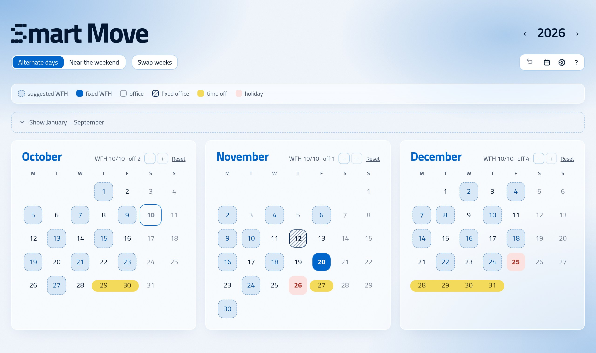
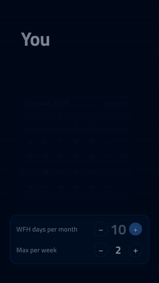
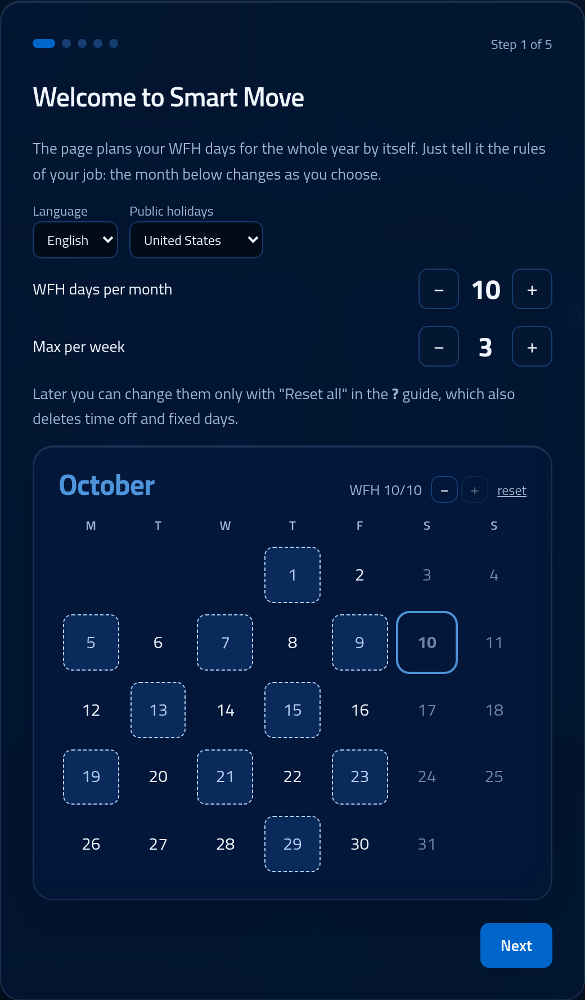
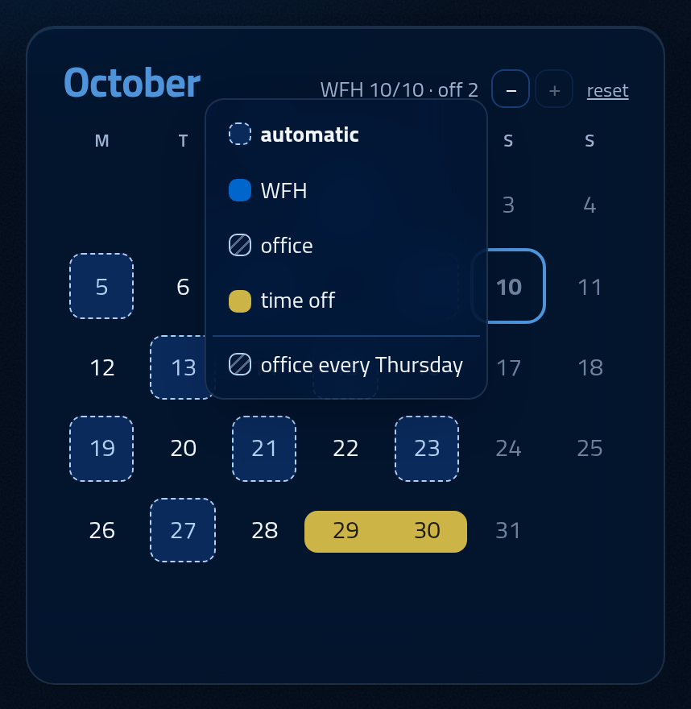
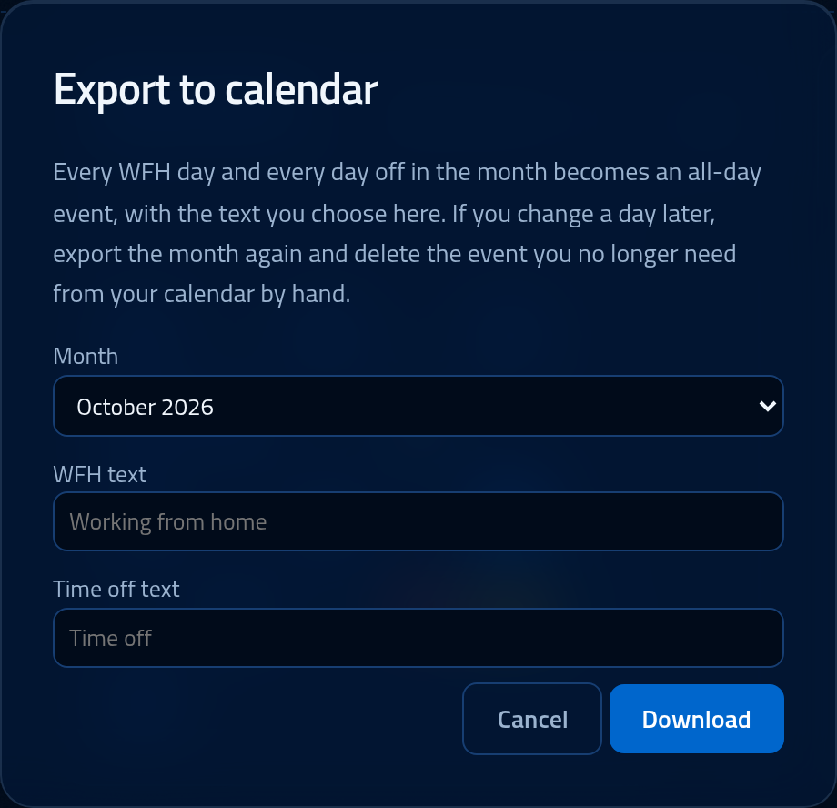
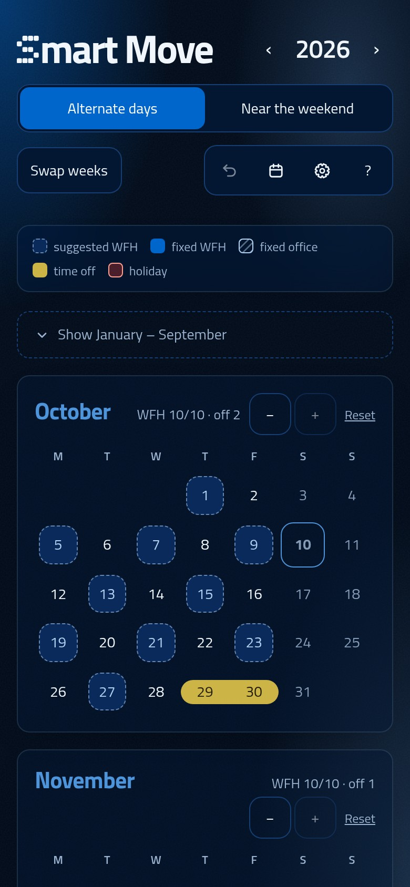

<div align="center">


[Italiano](README.md) · **English**

# Smart Move

**When am I in the office this month?**<br>
Smart Move has it covered: it plans your work-from-home days for the whole year, and you fine-tune whatever you need.

### [Open the app → 0ne-ctrl.github.io/smart-move](https://0ne-ctrl.github.io/smart-move/)

Free, no account. Your data stays in your browser.

<picture>
  <source media="(prefers-color-scheme: dark)" srcset="docs/en/desktop-dark.jpg">
  
</picture>

</div>

## In 20 seconds

<a href="docs/trailer-en.mp4"></a>

Monday? Wednesday? The long weekend? Max 3 a week, 10 a month, the week split between two months, Thanksgiving, bank holidays, your summer vacation…

Smart Move takes care of all of it and hands you a ready-made calendar: **dashed** days are suggested WFH days, **solid** ones are the ones you fixed, the **yellow highlighter** is time off, public holidays are in **red**.

Every change recalculates the whole year in an instant.

▶️ **[Watch the full trailer](docs/trailer-en.mp4)**

<br clear="right">

## What it does

### You set the limits
WFH days per month and max per week (10 and 3 by default), even in weeks split between two months. You choose them the first time you open the app, in a short guide with a preview of the month that changes as you go. A single month can have fewer with the −/+ buttons.

<p align="center"></p>

### Mark your time off
The plan recalculates itself. Click a day and choose: automatic, WFH, office or time off. Time off and public holidays don't reduce the month's quota.

<p align="center"></p>

### Two patterns
- **Alternate days**: spread-out WFH days, alternating Mon-Wed-Fri / Tue-Thu weeks, avoiding back-to-back days.
- **Near the weekend**: Mondays and Fridays first, then days next to holidays and time off, for long stretches away from the office.

### A fixed day
Office every Monday (or whichever day you like), all year, from the day menu. A single day you set by hand always wins over the rule.

### In your calendar
Export a month as an `.ics` file and import it into Google Calendar, Outlook or Apple Calendar: every WFH day and every day off becomes an event, with the text you choose.

<p align="center"></p>

## And also



- Public holidays built in for Italy, the United States, the United Kingdom (England & Wales), Germany, France, Spain and Greece, picked from a drop-down (or none). For the US: the six holidays nearly all employers observe (New Year's Day, Memorial Day, July 4, Labor Day, Thanksgiving, Christmas). Regional and local holidays, or any extra day off: mark them as time off.
- English or Italian: language and country start from your browser's and can be changed in the first-run guide or in the "?" guide.
- Designed for phones too, and **installable as an app** ("Add to Home Screen"): it works offline.
- Light and dark theme, with subtle sounds you can turn off.
- No server: everything stays in your browser. Use **Export / Import** (in the "?" guide) to move your data to another device.

<br clear="right">

## Development

A static site in HTML, CSS and JavaScript (ES modules), with no dependencies and no build step.

```sh
python3 -m http.server   # then open http://localhost:8000
node js/test.js          # logic tests: no "Assertion failed" = all good
```

- `js/plan.js`: the algorithm that picks the days (pure, no DOM); `js/holidays.js`: each country's public holidays
- `js/app.js`: interface, storage, first-run guide; `js/i18n.js`: English texts (Italian lives in `index.html`)
- `video/`: the trailer, made with [Remotion](https://www.remotion.dev/), with music and sound effects synthesized in code (instructions in `video/README.md`, in Italian)

Code comments are in Italian.

Font [Titillium Web](https://fonts.google.com/specimen/Titillium+Web), SIL OFL license (`fonts/OFL.txt`).
