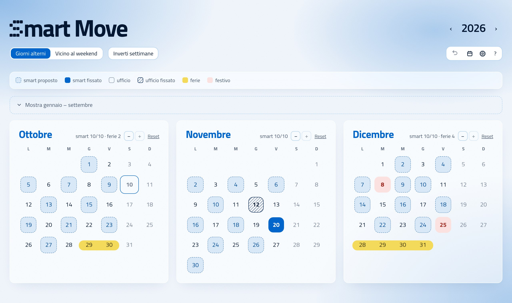
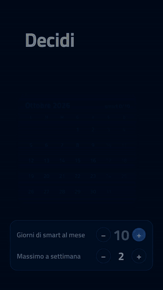
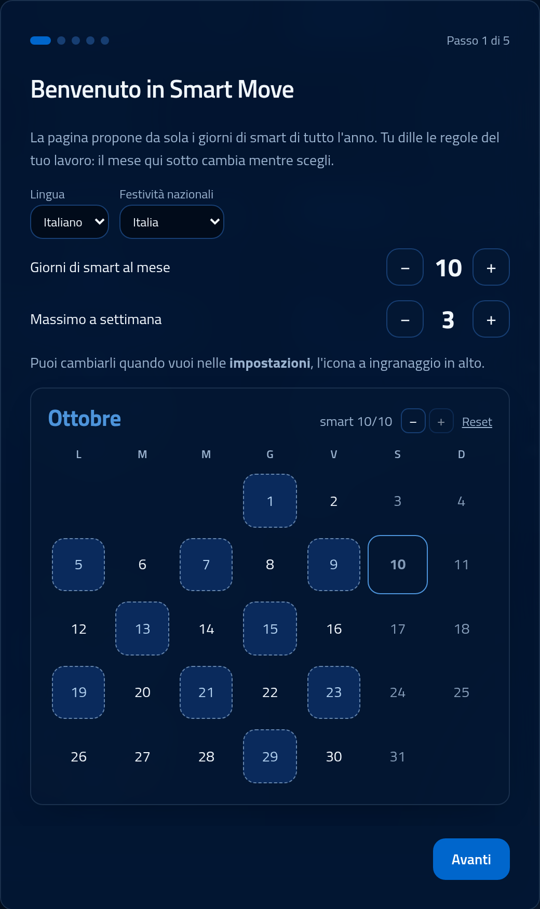
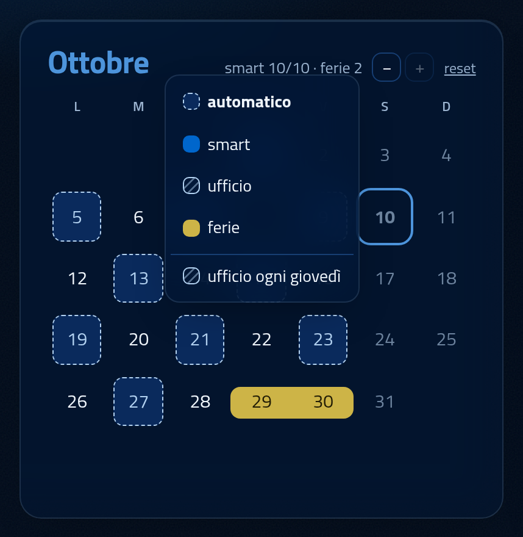
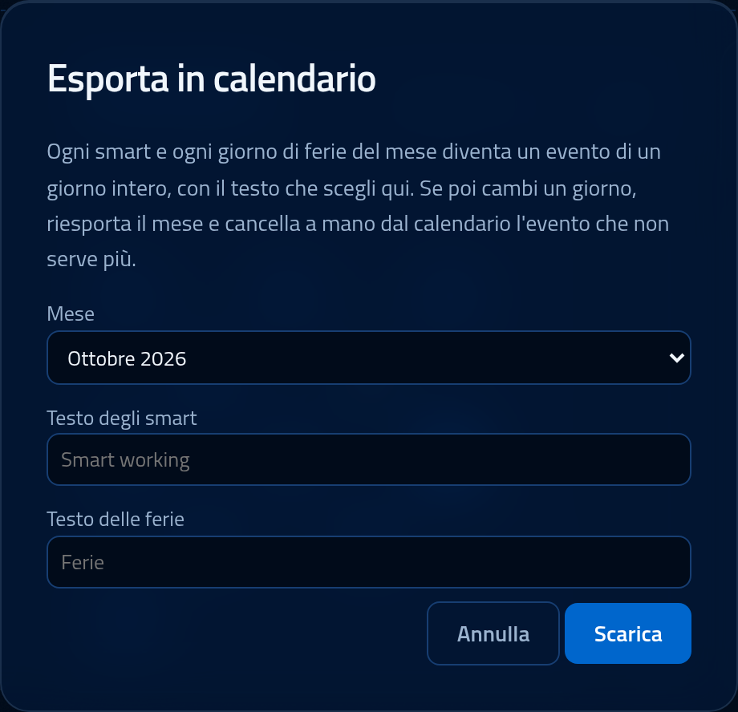
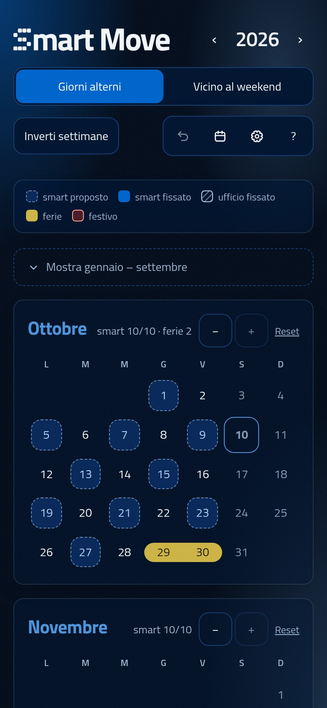

<div align="center">


# Smart Move

**Quando vado in ufficio questo mese?**<br>
Ci pensa Smart Move: propone da solo i giorni di smart working di tutto l'anno, tu sistemi a mano quello che serve.

### [Apri l'app → 0ne-ctrl.github.io/smart-move](https://0ne-ctrl.github.io/smart-move/)

Gratis, senza account. I dati restano nel tuo browser.

<picture>
  <source media="(prefers-color-scheme: dark)" srcset="docs/desktop-dark.jpg">
  
</picture>

</div>

## In 20 secondi

<a href="docs/trailer.mp4"></a>

Lunedì? Mercoledì? Il ponte? Max 3 a settimana, 10 al mese, la settimana a cavallo tra due mesi, Pasquetta, il 4 ottobre, le ferie ad agosto…

Smart Move tiene conto di tutto e ti dà un calendario già pronto: i giorni **tratteggiati** sono gli smart proposti, quelli **pieni** li hai fissati tu, l'**evidenziatore giallo** sono le ferie, in **rosso** i festivi.

Ogni modifica ricalcola l'anno intero in un attimo.

▶️ **[Guarda il trailer completo](docs/trailer.mp4)** (32 s, con l'audio)

<br clear="right">

## Cosa fa

### Decidi tu i limiti
Smart al mese e massimo a settimana (di base 10 e 3), anche nelle settimane a cavallo tra due mesi. Li scegli alla prima apertura, in una breve guida con un'anteprima del mese che cambia mentre scegli. Il singolo mese può averne meno con i pulsanti −/+.

<p align="center"></p>

### Segna le ferie
Il piano si ricalcola da solo. Clicca un giorno e scegli: automatico, smart, ufficio o ferie. Le ferie e i festivi non riducono la quota del mese.

<p align="center"></p>

### Due schemi
- **Giorni alterni**: smart distanziati, settimane alternate lun-mer-ven / mar-gio, evitando smart in giorni di fila.
- **Vicino al weekend**: prima lunedì e venerdì, poi i giorni attaccati a festivi e ferie, per blocchi lunghi lontano dall'ufficio.

### Un giorno fisso
Ufficio ogni lunedì (o il giorno che vuoi), tutto l'anno, dal menu del giorno. Un singolo giorno scelto a mano vince sempre sulla regola.

### Nel tuo calendario
Esporta un mese in un file `.ics` e importalo in Google Calendar, Outlook o Apple Calendar: ogni smart e ogni giorno di ferie diventa un evento, con il testo che scegli tu.

<p align="center"></p>

## E poi



- Festività nazionali italiane già escluse, compresi Pasquetta e il 4 ottobre (dal 2026). Il patrono lo segni come ferie.
- Pensata anche per il telefono, e **installabile come app** ("Aggiungi a schermata Home"): funziona anche offline.
- Tema chiaro e scuro, con suoni discreti che puoi spegnere.
- Niente server: tutto resta nel browser. Con **Esporta / Importa** (nella guida "?") porti i dati su un altro dispositivo.

<br clear="right">

## Sviluppo

Sito statico in HTML, CSS e JavaScript (moduli ES), senza dipendenze né build.

```sh
python3 -m http.server   # poi apri http://localhost:8000
node js/test.js          # test della logica: nessun "Assertion failed" = tutto ok
```

- `js/plan.js`: l'algoritmo che sceglie i giorni (puro, senza DOM)
- `js/app.js`: interfaccia, salvataggio, guida iniziale
- `video/`: il trailer, fatto con [Remotion](https://www.remotion.dev/), con musica ed effetti sintetizzati da codice (istruzioni in `video/README.md`)

Font [Titillium Web](https://fonts.google.com/specimen/Titillium+Web), licenza SIL OFL (`fonts/OFL.txt`).
